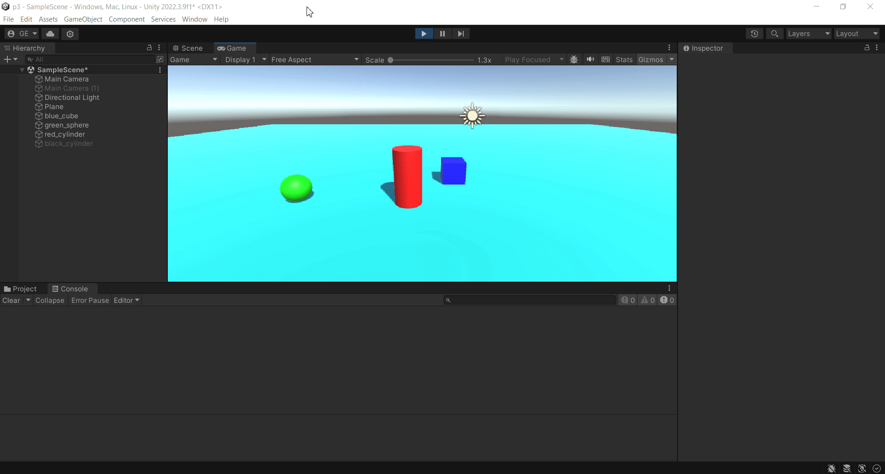
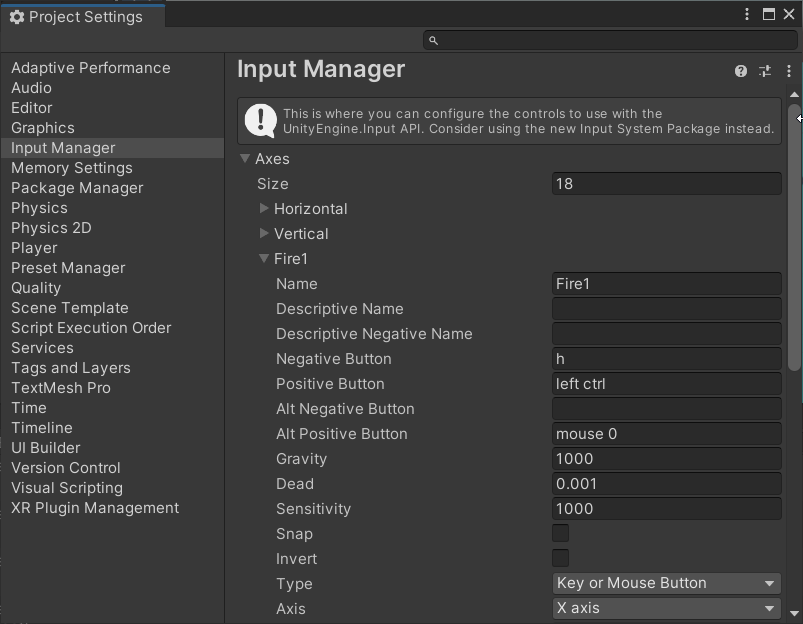
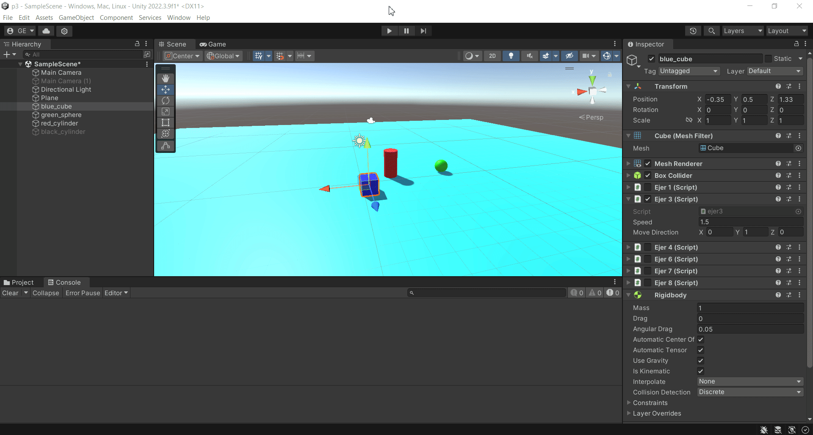
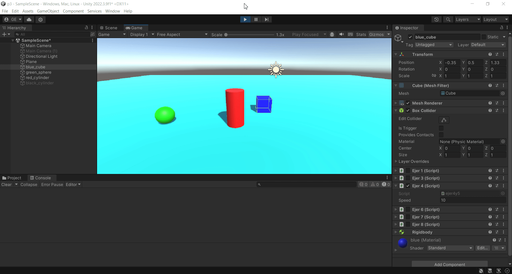
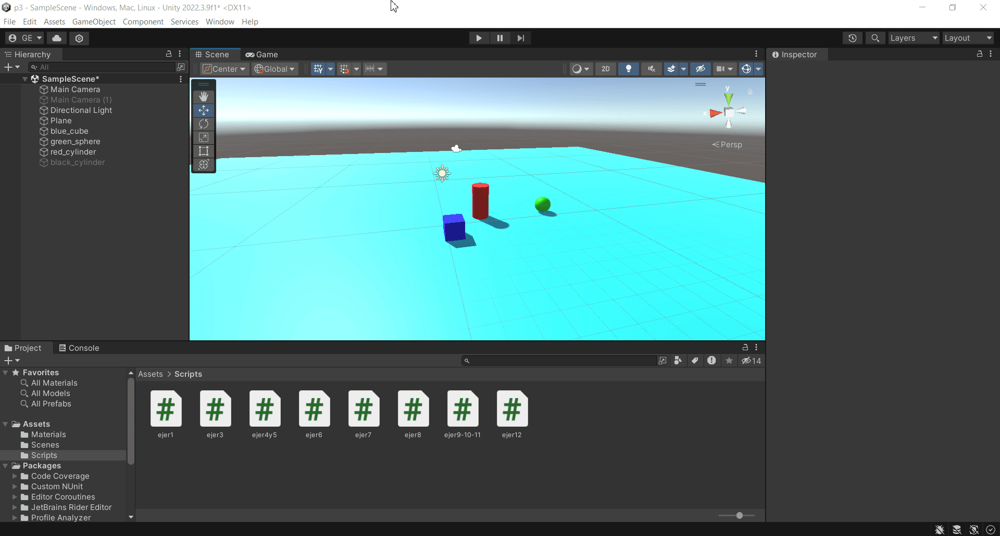
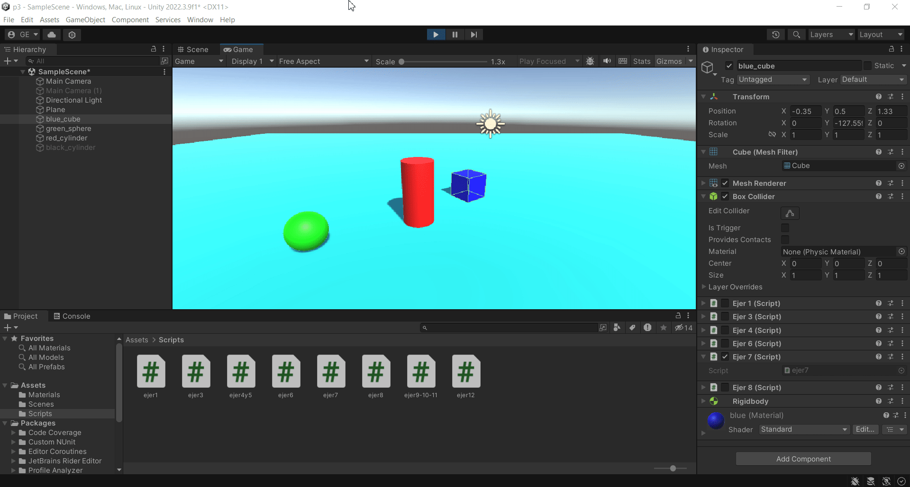
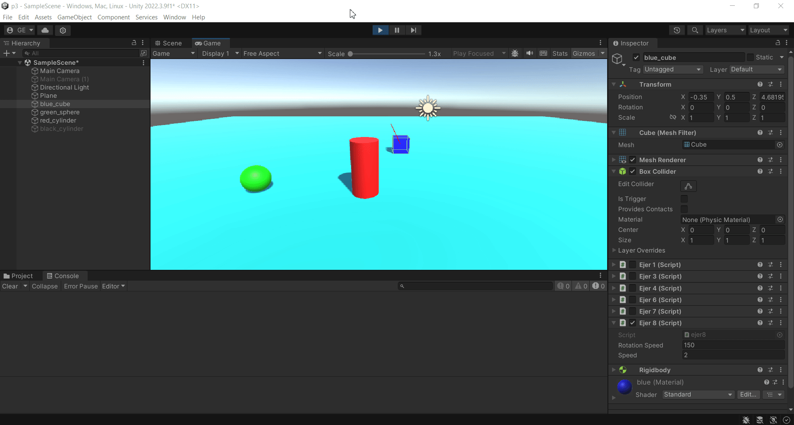
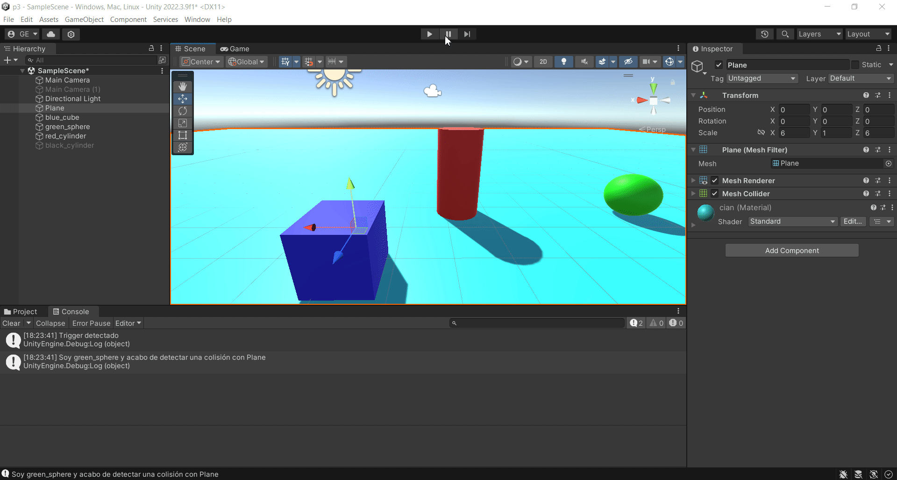
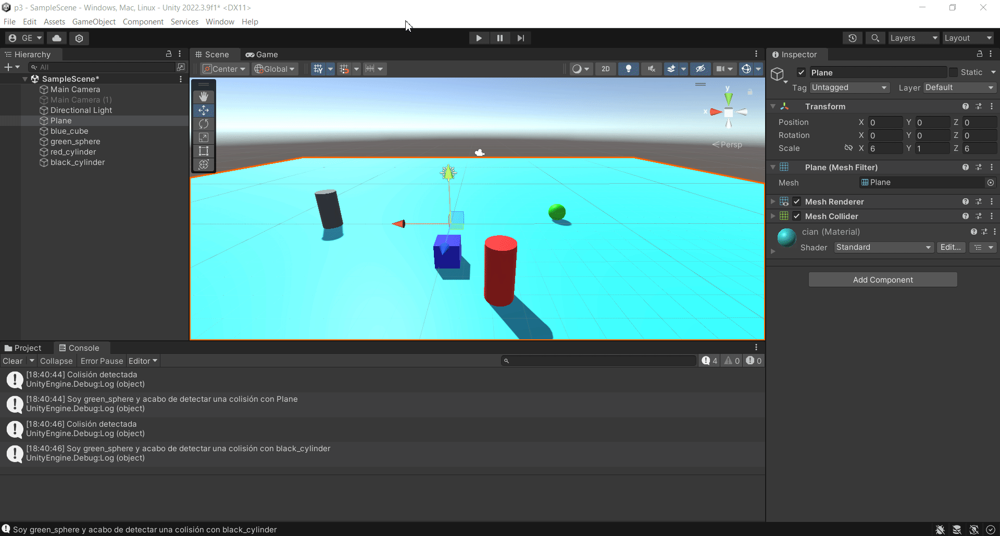

# Interfaces Inteligentes Práctica 3

## Ejercicios

1. Agrega un campo velocidad al cubo de la práctica anterior y asígnale un valor que se pueda cambiar en el inspector de objetos. Muestra la consola el resultado de multiplicar la velocidad por el valor del eje vertical y por el valor del eje horizontal cada vez que se pulsan las teclas flecha arriba-abajo ó flecha izquierda-derecha. El mensaje debe comenzar por el nombre de la flecha pulsada. 

Script: [ejer1.cs](scripts/ejer1.cs)

---

2. Mapea la tecla H a la función disparo. 

---

3. Crea un script asociado al cubo que en cada iteración traslade al cubo una cantidad proporcional un vector que indica la dirección del movimiento: moveDirection que debe poder modificarse en el inspector. La velocidad a la que se produce el movimiento también se especifica en el inspector, con la propiedad speed. Inicialmente la velocidad debe ser mayor que 1 y el cubo estar en una posición y=0. En el informe de la práctica comenta los resultados que obtienes en cada una de las siguientes situaciones:

- Duplicas las coordenadas de la dirección del movimiento.

    - El cubo se mueve al doble de velocidad independientemente de la velocidad que tenga.

- Duplicas la velocidad manteniendo la dirección del movimiento.

    - El cubo se mueve al doble de velocidad independientemente de la dirección que tenga.

- La velocidad que usas es menor que 1

    - El cubo se mueve más lentamente.

- La posición del cubo tiene y > 0

    - El cubo parte de una posición más elevada pero se mueve igual de rápido.

- Intercambiar movimiento relativo al sistema de referencia local y el mundial.

    - No pasa nada fuera de lo normal.

Script: [ejer3.cs](scripts/ejer3.cs)

---

4. Mueve el cubo con las teclas de flecha arriba-abajo, izquierda-derecha a la velocidad speed. Cada uno de estos ejes implican desplazamientos en el eje vertical y horizontal respectivamente. Mueve la esfera con las teclas w-s (movimiento vertical) a-d (movimiento horizontal).

5. Adapta el movimiento en el ejercicio 4 para que sea proporcional al tiempo transcurrido durante la generación del frame.

Script: [ejer4y5.cs](scripts/ejer4y5.cs)

---

6. Adapta el movimiento en el ejercicio 5 para que el cubo se mueva hacia la posición de la esfera. Debes considerar, que el avance no debe estar influenciado por cuánto de lejos o cerca estén los dos objetos. 

Script: [ejer6.cs](scripts/ejer6.cs)

---

7. Adapta el movimiento en el ejercicio 6 de forma que el cubo gire hacia la esfera. Realiza pruebas cambiando la posición de la esfera mediante las teclas awsd

Script: [ejer7.cs](scripts/ejer7.cs)

---

8. Utilizar el eje “Horizontal” para girar el objetivo y que avance siempre en la dirección hacia adelante.

 

Script: [ejer8.cs](scripts/ejer8.cs)

---

9. Configura el cilindro como un objeto físico, cuando el cubo o la esfera colisionen con él se debe mostrar un mensaje en consola con la etiqueta del objeto que haya colisionado. 

10. Configura el cubo como un objeto cinemático y la esfera como un objeto físico. Adapta los scripts del ejercicio 9 para obtener el mismo comportamiento.

11. Configura el cilindro como un objeto de tipo Trigger. Adapta los scripts de los ejercicios anteriores para obtener el mismo comportamiento.

 

Script: [ejer9-10-11.cs](scripts/ejer9-10-11.cs)

12. Agrega un cilindro de un color diferente al que ya hay en la escena y configúralo como un objeto físico. Selecciona un conjunto de teclas que te permitan controlar su movimiento por la escena y prográmale un movimiento que permita dirigirlo hacia la esfera.

 

Script: [ejer12.cs](scripts/ejer12.cs)

- Esfera con masa 10 veces más que el cilindro:
    - Al cilindro le cuesta más mover a la esfera.
- Esfera con masa 10 veces menos que el cilindro.
    - Al cilindro le cuesta más moverse hacia la esfera.
- Esfera cinemática:
    - La esfera no se mueve y el cilindro se mueve queda pegado la esfera.
- Esfera trigger:
    - El cilindro atraviesa la esfera.
- Cilindro con fricción duplicada.
    - El cilindro se mueve más lentamente ya que la fricción hace que se frene.

--- 

